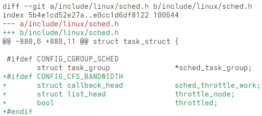

== evolution-module-patch

This Evolution module tries to mirror the functionality of the Thunderbird
https://github.com/Qeole/colorediffs[colorediffs] plugin to Evolution.

Example:

=== How to build

==== Install build dependencies

Build dependencies for Debian based distributions are documented inside the
link:debian/control[] file.

For Fedora the `evolution-devel` package should be enough.

==== Build and install for the current user (only)
[source,bash]
----
./build-and-install-as-user
----

==== Build and install for all users (distro build)
[source,bash]
----
mkdir build
cd build
cmake ..
cmake --build .
sudo cmake --install .
----

=== How to change your theme

[source,bash]
----
gsettings set org.gnome.evolution.text-highlight theme <theme-name>
----

A list of theme names can be found in `/usr/share/highlight/themes`. After
the theme has been changed, it should be enough to switch to a different
mail in Evolution.

To get the current active theme use

[source,bash]
----
gsettings get org.gnome.evolution.text-highlight theme
----